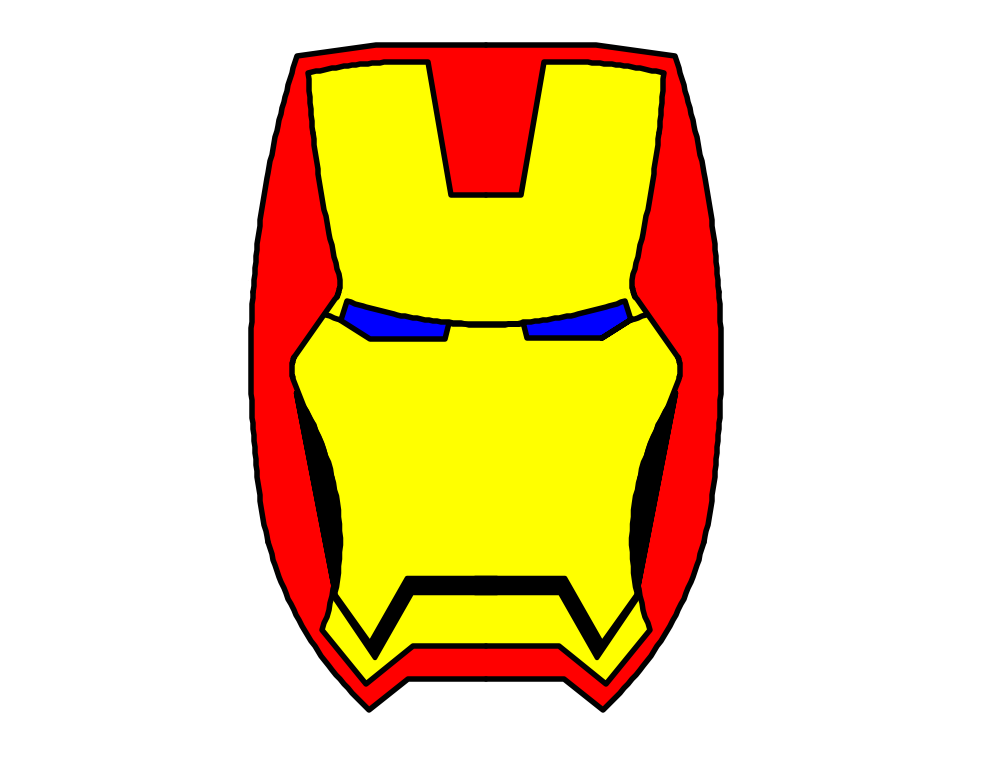

# Iron Man Helmet - Python Turtle
This project is a step-by-step creation of Iron Man's helmet using the Python Turtle library.

## Progress
- Completed the outer shell of the helmet. (red color)
- Completed the inner face cover of the helmet. (yellow coloured)
- Completed the Eyes. (blue color).
- Completed the face vantilations and mouth shape. (black)
  #### Ironman Helmit project is completed.

## How to Run
1. Ensure Python is installed on your system along with the module `turtle`.
2. Run the `ironman_helmet.py` file.

# Output of the Project.
Below is the output image of this project for demonstration.
